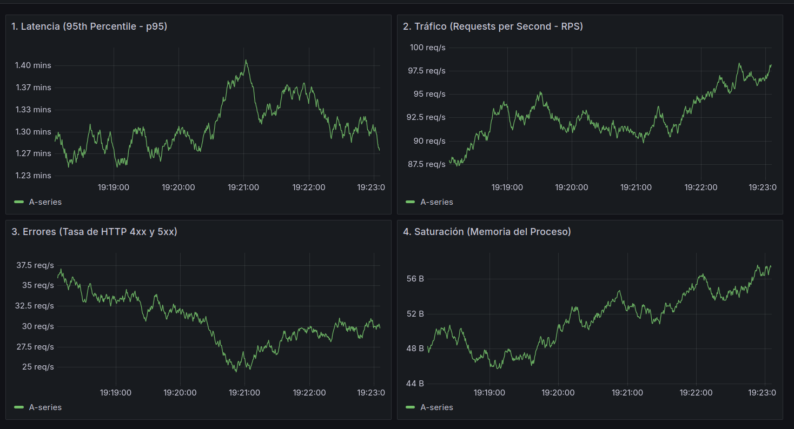
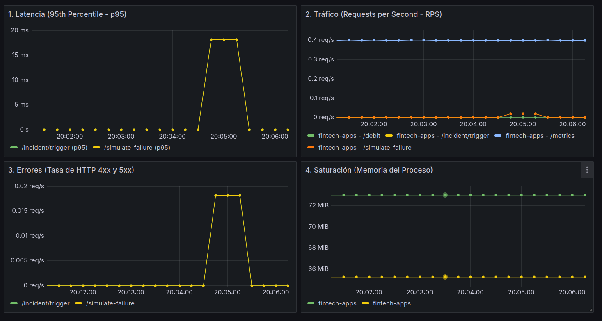

# 🏦 K8s Fintech Observability Stack


¡Bienvenido/a! Este repositorio contiene la implementación individual de un **stack completo de observabilidad en Kubernetes (k3d)** diseñado para monitorear una arquitectura de microservicios distribuida en un entorno bancario / fintech.

El objetivo principal de este proyecto es demostrar cómo capturar, visualizar y correlacionar los **3 pilares de la observabilidad (Métricas, Trazas y Logs)** ante escenarios de alta exigencia e incidentes críticos en producción.

---

## 🏗️ Arquitectura del Sistema

El ecosistema se compone de dos microservicios desarrollados en Python con **FastAPI**, altamente instrumentados para observabilidad:

1. **`transfer-api` (API Gateway):** 
   Punto de entrada expuesto que recibe las intenciones de transferencias financieras de los usuarios y propaga el contexto de traza (*W3C Trace Context*) hacia el backend.
2. **`wallet-ledger` (Backend Transaccional):** 
   Microservicio encargado de la validación de fondos y el débito en cuenta. Contiene la lógica de negocio y spans personalizados de OpenTelemetry (`validar_fondos`, `debitar_cuenta`).

```
[ Cliente / Curl ]
       │
       ▼ (HTTP POST /transfers)
┌─────────────────────────┐
│   transfer-api Gateway  │  ───(OTLP gRPC)───┐
└─────────────────────────┘                   │
       │                                      │
       ▼ (HTTP POST /debit + traceparent)     │
┌─────────────────────────┐                   ▼
│  wallet-ledger Backend  │  ───(OTLP gRPC)───► [ Jaeger UI ]
└─────────────────────────┘                   ▲
       │                                      │
       ▼ (Metrics Scraping)                   │
┌─────────────────────────┐                   │
│       Prometheus        │  ─────────────────┘
└─────────────────────────┘
       │
       ▼
┌─────────────────────────┐
│        Grafana          │ (Dashboard 4 Golden Signals)
└─────────────────────────┘
```

---

## 🛠️ Stack Tecnológico

| Componente | Tecnología | Descripción / Rol |
| :--- | :--- | :--- |
| **Orquestación** | `k3d` / `k3s` | Cluster de Kubernetes local ligero ejecutado sobre Docker. |
| **Microservicios** | `FastAPI` (Python 3.11) | APIs REST asíncronas para el Gateway y el Ledger. |
| **Trazabilidad** | `OpenTelemetry` + `Jaeger` | Exportación OTLP gRPC y visualización gráfica de trazas distribuidas. |
| **Métricas** | `Prometheus` | Recolección de métricas de proceso y métricas HTTP (`prometheus-fastapi-instrumentator`). |
| **Visualización** | `Grafana` | Dashboard en tiempo real configurado con los **4 Golden Signals**. |
| **Logs Estructurados**| `structlog` | Formato JSON con inyección automática de `trace_id` y `span_id`. |

---

## 📊 Los 3 Pilares en Acción

### 1. Métricas: Dashboard de los 4 Golden Signals (SRE)
Monitoreo en tiempo real basado en las prácticas SRE de Google:
- **Latencia (Latency):** Histograma P95/P99 de respuesta HTTP.
- **Tráfico (Traffic):** Peticiones procesadas por segundo (Req/s).
- **Errores (Errors):** Tasa de fallas HTTP 4xx y 5xx.
- **Saturación (Saturation):** Consumo de memoria y recursos de los Pods.



---

### 2. Trazas Distribuidas (Jaeger UI)
Cada petición genera un flujo visual completo que atraviesa ambos microservicios, midiendo los tiempos exactos de la llamada HTTP y de los procesos internos (`validar_fondos` y `debitar_cuenta`).



---

### 3. Logs Correlacionados JSON (`trace_id`)
Los logs se emiten en formato JSON estructurado. Al ocurrir una anomalía, se puede tomar el `trace_id` del log y pegarlo en Jaeger para inspeccionar visualmente el origen del problema:

```json
{
  "account": "ACC-001",
  "amount": 150.0,
  "event": "Verificando solicitud de debito",
  "level": "info",
  "trace_id": "6e4e8608424489d619a85297aab12b0c",
  "span_id": "9b32e7e63b9584a0",
  "timestamp": "2026-09-20T21:22:51.400Z"
}
```

---

## 💥 Simulación de Incidente Crítico (SEV-1) & Postmortem

El proyecto incluye un endpoint de simulación de fallas en cascada (`/incident/trigger`) diseñado para realizar pruebas de resiliencia (*Chaos Engineering*). 

Se provocó a propósito un incidente de **Severidad 1 (SEV-1)** por bloqueo de base de datos (*deadlock*) y latencia extrema.


📄 **Informe completo de Root Cause Analysis (RCA):**  
Podés consultar el informe técnico detallado del incidente en [documents/RCA_INCIDENT_SIMULATION.md](documents/RCA_INCIDENT_SIMULATION.md).

---

## 🚀 Despliegue Local Rápidos (k3d)

### 1. Crear el cluster en `k3d`:
```bash
k3d cluster create fintech-cluster \
  -p "3000:3000@server:0" \
  -p "8080:8080@server:0" \
  -p "16686:16686@server:0"
```

### 2. Compilar e importar las imágenes:
```bash
docker build -t transfer-api:latest ./apps/transfer-api
docker build -t wallet-ledger:latest ./apps/wallet-ledger
k3d image import transfer-api:latest wallet-ledger:latest -c fintech-cluster
```

### 3. Aplicar Manifiestos de Kubernetes:
```bash
kubectl apply -f k8s/observability/
kubectl apply -f k8s/apps/
```

### 4. Accesos a los Servicios:
- 📊 **Grafana:** `http://localhost:3000` (User: `admin` / Pass: `admin`)
- 🔍 **Jaeger UI:** `http://localhost:16686`
- 💳 **API Gateway:** `http://localhost:8080`

---

## 👨‍💻 Autor
Proyecto desarrollado de forma individual por **Tomás Drago** como trabajo final de la materia **Observabilidad y Confianza**.
