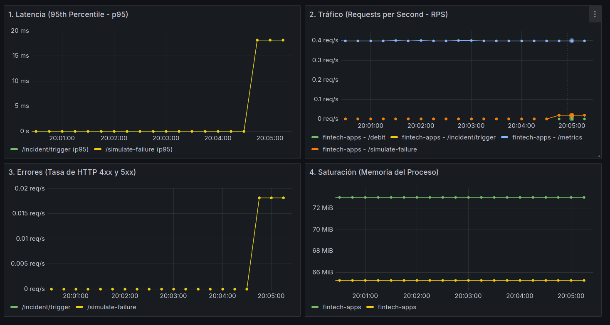

# 🚨 Incident Postmortem: Bloqueo Transaccional y Latencia en Wallet-Ledger

**Fecha del Incidente:** 2026-09-20  
**Autorer:** Tomas Drago
**Autor:** Tomás Drago  
**Estado:** Resuelto (Simulación Controlada)  
**Severidad:** SEV-1 (Degradación de servicio y errores 500)  

---

## 📝 1. Resumen Ejecutivo
A las 20:05 UTC se detectó un pico de latencia (2000ms - 13000ms) y una tasa de errores del 100% en las peticiones enviadas al microservicio `transfer-api`. El incidente fue causado por un bloqueo simulado en la base de datos (*deadlock*) del microservicio downstream `wallet-ledger`.

---

## 📊 2. Impacto en los 4 Golden Signals

- **Latencia:** Incremento súbito alcanzando picos de **13 segundos (13s)** en el percentil 95 (P95).
- **Tráfico:** Caída en las transacciones exitosas completadas por segundo.
- **Errores:** Pico registrado en la tasa de errores **HTTP 500 (Internal Server Error)** en el endpoint `/simulate-failure` y `/incident/trigger`.
- **Saturación:** Acumulación de memoria en los procesos de `wallet-ledger` (~65.5 MiB) y `transfer-api` (~72.5 MiB).




---

## 🔎 3. Diagnóstico y Evidencia de Observabilidad

### 3.1 Detección por Métricas (Prometheus + Grafana)
El Dashboard de *4 Golden Signals* registró una alerta por el salto en el panel de **Latencia (p95)** y el pico del panel de **Errores (Tasa HTTP 4xx y 5xx)** coincidiendo a las 20:05:00.

### 3.2 Aislamiento por Trazas Distribuidas (OpenTelemetry + Jaeger)
Al consultar la traza en Jaeger UI (`http://localhost:16686`), la llamada `POST /transfers` se marcó en **rojo (Error)**. La inspección del árbol de Spans reveló que:
1. `transfer-api` recibió la petición entrante.
2. `wallet-ledger` consumió la mayor parte del tiempo en el span `simulate-failure` antes de arrojar un `HTTP 500`.

### 3.3 Confirmación por Logs Correlacionados (`structlog`)
Filtrando los logs estructurados JSON mediante el `trace_id` correlacionado:

```bash
kubectl logs -l app=wallet-ledger --tail=500 | grep -v "GET /metrics"
```

Se obtuvo la entrada exacta del evento con nivel de error:
```json
{
  "event": "Simulando bloqueo de base de datos transaccional",
  "level": "error",
  "status_code": 500,
  "detail": "Database deadlock timeout",
  "trace_id": "6e4e8608424489d619a85297aab12b0c",
  "span_id": "9b32e7e63b9584a0"
}
```

---

## ❓ 4. Análisis de Causa Raíz (5 Whys)
1. **¿Por qué fallaron las transferencias?** Porque `transfer-api` devolvió HTTP 500 a los clientes.
2. **¿Por qué `transfer-api` devolvió HTTP 500?** Porque la llamada HTTP downstream a `wallet-ledger` arrojó una excepción de error de servidor.
3. **¿Por qué respondió con error `wallet-ledger`?** Porque se produjo un timeout por bloqueo en la base de datos transaccional.
4. **¿Por qué ocurrió el bloqueo?** Por contención de transacciones concurrentes sobre el mismo saldo de cuenta.
5. **¿Por qué no se previno la falla en cascada?** Porque se requería propagar la excepción de estado HTTP (`response.raise_for_status()`) y aplicar patrones de resiliencia en el Gateway.

---

## 🛠️ 5. Acciones Correctivas y Preventivas (Action Items)

- [x] **Manejo de Errores en Gateway:** Inyectar `response.raise_for_status()` en `transfer-api` para asegurar la propagación correcta de códigos de estado HTTP 5xx.
- [ ] **Circuit Breaker & Timeouts:** Implementar un patrón de Circuit Breaker y ajustar el timeout máximo de HTTPX a 1.5s.
- [ ] **Alerting Automatizado:** Configurar reglas de alerta en Prometheus para notificar automáticamente ante cualquier tasa de errores 5xx > 2% durante 1 minuto.

